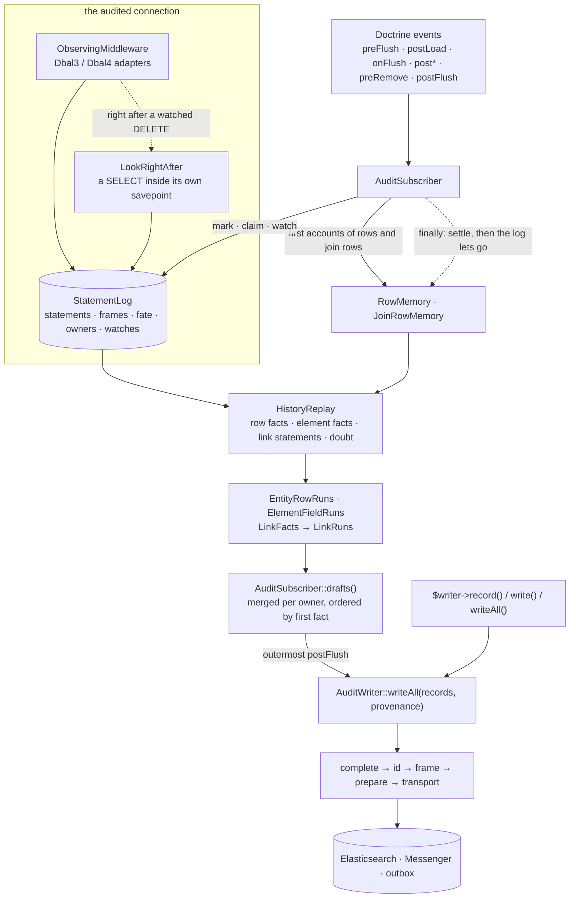

# Architecture

This page is for whoever has to change the Doctrine listener or the writer and must not break
the history on the way. It is the map to read before opening the code: what each part is
responsible for, in the order the data flows through it, what holds between the parts, where a
change of each kind belongs, and which tests will tell you that you got it wrong.

It names classes and methods, never line numbers. Where a class's docblock and this page
disagree, the code is the truth and one of the two needs fixing.

One sentence carries most of the design, so it comes first: **since 1.3, the history of a
Doctrine flush is read from what the connection ran, not from what Doctrine said it planned.**
Change sets are emptied by nested flushes, filled by refused ones, and describe the plan rather
than the write. The connection sees the statement, whether it failed, how many rows it touched,
and every boundary of the transaction it ran in. Everything on the Doctrine side is built to
turn that into records.

## The path, in one picture

## Two roads into the writer

**The application's road.** `AuditWriter::record()` builds an `AuditRecord` and hands it to
`write()`; `write()` takes one record, `writeAll()` a batch. These are for everything that is
not an entity change: a call placed, a login refused. `write($record, immediately: true)` skips
the frame and the configured transport and goes to the immediate transport — and is refused
inside an open `AuditTransaction` (`OutboxException`), because it would reach Elasticsearch
before the commit.

**The listener's road.** `src/Doctrine/AuditSubscriber.php` collects nothing into records while
a flush runs. At the outermost `postFlush` it reads the connection's log into drafts, turns them
into records, and calls `writeAll($records, $provenance)` once per stretch of records that share
a flush — handing over the moment that flush settled in its `onFlush`, so the records carry the
time and actor of where the change happened, not of where it was written.

Both roads meet in the same pipeline, so a record is completed, merged, redacted and sent the
same way whichever road it came by.

## The writer's pipeline

`src/Writer/AuditWriter.php` is the one entry point for writing history. In order:

1. **Complete** — `complete()`. Fills in what the caller left out: `loggedAt`, the actor, the
   id, the moment enrichers' attributes (`MomentEnricherInterface`, described once per moment),
   then the ordinary enrichers (`AuditEnricherInterface`, not the merged ones), scoped by
   `EnricherScope`. With a `Provenance`, everything that would come from "now" comes from it.
2. **Ids** — `src/Writer/RecordId.php`, `IdSequence.php`, `AuditWriter::sequenceOf()`. An id is
   a UUID v7 built from `loggedAt`. The bits after the timestamp are a counter: an `IdSequence`
   per millisecond, shared by every `Provenance` of that millisecond that is alive, and by the
   latest millisecond asked about. So the records of one writer in one millisecond sort by id in
   the order they were built. A counter nobody holds is let go (weak references), and that
   millisecond met again starts from a random point. Nothing is promised across writers or
   processes. Running out of a counter is an error, never a quiet restart.
3. **Frame** — `src/Coalescing/FrameBuffer.php`, opened and closed by `AuditFrame.php`. Inside an
   open frame a record of a coalesced object type is *held*, one per object, and merged with the
   next one for the same object: earliest `old`, latest `new`, a field that moved and came back
   is dropped, a field that never moved (context) stays. The outermost close releases. Three
   things release early in an ordinary frame: a remove (terminal), a step by a different actor,
   and `max_held`. An *atomic* frame (`begin(atomic: true)`, or `on_overflow: throw`) *stages*
   those instead and refuses an overflow with `FrameOverflowException`, after which the buffer
   is poisoned until the outermost frame closes. A type the frame does not coalesce is staged
   when the frame stages everything, and otherwise goes straight through.
4. **Prepare** — `prepare()`, on the way out, for every record that leaves (released by a frame
   or never held): the merged enrichers (`MergedRecordEnricherInterface`) see the merged record,
   then `ChangeRedactor` redacts, then `RecordCreatedEvent` is dispatched and may replace or
   veto the record, then the result is redacted again. A veto inside an audit transaction spoils
   it (`OutboxContext::spoil()`).
5. **Transport** — `src/Transport/*`. `SyncTransport` writes through the gateway (one call, or one
   `_bulk`); `MessengerTransport` dispatches `IndexAuditRecord` / `IndexAuditRecords` for the
   handlers to write from a worker; `OutboxTransport` sends straight to a Doctrine Messenger queue
   on the application's connection, inside the transaction `AuditTransaction` holds.
   `ImmediateTransportGuard` refuses the immediate road while an audit transaction is open.
   `WrittenAt` stamps the write attempt on the document in the transport, not in the gateway.
   Batches are chunked by `batch_size`; every record carries an id, so a re-sent batch overwrites
   itself.

Failures go through `FailurePolicy` in `reportFailure()`: logged and swallowed by default,
`WriteFailedException` under `throw`. The rule throughout is that one broken record costs its own
record and no other: completion failures, preparation failures and per-item refusals are
collected and reported after the rest have gone out. `FrameOverflowException` and
`NotConfiguredException` are not write failures and are never swallowed.

## The Doctrine side, in the order the data flows

### Watching the connection

`src/Doctrine/Observation/ObservingMiddleware.php` is a DBAL driver middleware, registered by the
extension with the `doctrine.middleware` tag on `doctrine.connection`, so DoctrineBundle is what
applies it. `ObservingMiddleware::onDbal3()` asks the driver interface which DBAL is installed and
picks `Dbal3\ObservedConnection` or `Dbal4\ObservedConnection` (with their `ObservedStatement`).
The two differ only in what the driver interface forces: DBAL 3's transaction methods return the
driver's boolean.

The adapters are observers and held to it. They change no parameter, return what the driver
returned, rethrow every exception as it came, and leave the connection's options alone. They tell
the log:

- every statement that writes — its SQL, bound parameters, affected count — with
  `StatementLog::executed()`, and a failed one with `failed: true`. A statement that only reads
  (`StatementLog::onlyReads()`: `SELECT`, `SHOW`, `PRAGMA`, `EXPLAIN`) through `prepare()` or
  `query()` is not kept;
- `beginTransaction()`, `commit()`, `rollBack()` as `began()`, `committed()`, `rolledBack()`;
- savepoints arrive as statements (`SAVEPOINT`, `RELEASE SAVEPOINT`, `ROLLBACK TO SAVEPOINT`),
  and `executed()` recognises those three and nothing else of SQL.

**The look right after a DELETE.** `src/Doctrine/Observation/LookRightAfter.php` is the one place
the observer runs a statement of its own. After a statement has run and been logged, it asks the
log `toObserveAfter()`; for a DELETE that took a row of a watched key it runs the watch's question
on the connection *underneath* the observed one — so it is never logged and cannot set off
another look — and records the answer with `observed()`. Inside a transaction it opens its own
savepoint and rolls back to it on failure, because on PostgreSQL a failed statement spoils the
transaction. A question that fails is `null`: not known, never nothing. This is the only moment at
which what a cascade took can be seen, since Doctrine runs every DELETE of a flush before
announcing the first removal.

### StatementLog

`src/Doctrine/Observation/StatementLog.php` holds what the connection did, in order, and what
became of it. It parses no SQL beyond the savepoint statements and knows nothing about entities.

**Statements** are numbered by a sequence (`position()`), each with the frame it ran in (`-1`
outside any transaction) and a `void` flag.

**Frames** are a tree of openings, not a depth. Every `BEGIN` and every `SAVEPOINT` opens a frame
with an identity of its own — DBAL names savepoints after their level, so two nested flushes one
after the other both open `DOCTRINE_2`, and a name would mix them up.

- `ROLLBACK TO` voids everything run since the savepoint opened, in it and inside it, leaves it
  open, and marks it dead: it no longer belongs to the flush that opened it.
- `RELEASE` hands a frame's statements to the frame around it and makes nothing final.
- Only the outermost `COMMIT` makes anything final; the outermost `ROLLBACK` voids everything.
- Without savepoints (DBAL 3's default) a nested transaction opens nothing on the wire, and what
  is seen is the outermost rollback.

**Fate** — `fate()` — is `VOID` (voided, failed, or let go of), `COMMITTED` (autocommit, or its
outermost frame committed) or `PENDING`. `voided()` counts every statement a rollback has ever
voided; a reader that keeps its place carries on only while that number has not moved.

**Ownership by flush.** Whose moment a statement carries is a separate question from whether it
stands, and the log answers them apart.

- `mark()` is taken in `onFlush`, before Doctrine begins the flush's transaction.
- `claim()` is called after one of the flush's statements has run: it labels the last frame
  opened since the mark directly inside the frame open then. After the fact on purpose — a label
  handed ahead was taken by whatever opened first. A dead frame is not claimed.
- `ownerOf()` is the label of the innermost labelled frame a statement ran in; an unlabelled frame
  lends its statements to the frame around it. Failing that, the `owner` a `claimUnowned()` wrote
  on the statement: a flush owns what ran while it did where no frame says whose it is — which is
  every nested flush without savepoints.
- `aFlushStarts()` / `aFlushStartedAfter()` record where a flush began, which is what tells one
  change of a JOINED entity written a table at a time from two changes when there is no frame
  between them.
- `hasDoneAnythingFor()` says whether a statement a flush owns stayed done — how a flush that only
  emptied a collection, and raised no event, is told from one refused before it wrote.

**Watches.** `watch()` is set by the listener for a flush about to remove rows that others' join
rows point at: the table, the key's columns, the keys worth a look, the question to ask, every
key about to go, and the join table that points at them. A key is looked at once something says a
row may point at it: it was held when the flush began, or an `INSERT` into the join table wrote a
row for it since (`aJoinRowWritten()`, called from `executed()`, arms the key). A watch says
*when* to look; what the look sees is the fact. What is seen is kept with the statement
(`observationsOf()`) and shares its fate. Watches go with their flush (`forgetTheWatchesOf()`,
from `postFlush`); one left behind does no harm.

**Tables kept.** From the listener's first flush on (`keepingOnly()`, set at `preFlush`), the log
keeps the text of a statement only if it is of a table a history is about
(`WatchedRows::isAHistoryTable()`), or cannot be read at all. Transactions and savepoints are always
kept. Any other statement keeps its place, its frame and whether it failed, with no SQL and no
parameters, and `statement()` returns `null` for it. The place is what parts one change of a JOINED
row from the next, and what says a join row's `DELETE` is not right before its owner's. A statement
of that kind can still be rolled back, like any other. The back-to-back statements of one frame
share a single entry.

**Forgetting.** `forgetUpTo()` lets go of statements, flush-start marks and closed frames nothing
needs any more. The listener calls it only after its row memory has settled. `new StatementLog(letsGo: false)`
keeps everything, for tests that replay the log on their own.

### What the rows held

The log says what statements did; to say what a value was *before* a statement, the rows have to
be known from somewhere. Only rows a history is written about are remembered.

**`WatchedRows`** decides which: a class with an audit declaration, and a class that is the element
of an audited inverse collection (`areWatched()`); an owning ManyToMany among an audited owner's
fields (`areLinksWatched()`); and, for a target class, which watched links it is the target of
(`linksTo()`). Asked once per class and cached. It also answers two questions about the whole
mapping. The first is which classes a representer may be handed as they stood (`areShownAsTheyStood()`):
the replay keeps versions only of those. The second is which tables' statements the log keeps
(`isAHistoryTable()`). Both answers are kept by the manager's metadata factory, because managers that
share a connection share the listener (rule 13).

**`RowMemory`** (`src/Doctrine/Observation/RowMemory.php`) holds each watched row's columns as
database values, by root class and key.

- The first account of a row comes from Doctrine's original entity data at `preFlush`
  (`rememberWhatIsManaged()`, including scheduled deletions), before `computeChangeSets()` writes
  the plan over it — or at `postLoad` for a row first loaded while a flush runs
  (`rememberLoaded()`). The first account is kept; a later one is not believed over it. An entity
  scheduled for insert is not a row yet: its `INSERT` says what it holds.
- `rememberTheRowsOf()` reads, as rows and with filters bypassed, the elements of an inverse
  collection about to be emptied that nobody loaded.
- `rememberPersisted()` binds the row a `postPersist` announces to its object. Not its key: a
  key the database handed out is its `INSERT`'s own, the connection's answer right after it
  (`StatementLog::keyHandedOut()`). Doctrine asks for it there, before anything else runs
  (`tests/Doctrine/Keys/WhereDoctrineAsksForAGeneratedKeyTest.php`); the order rows are announced
  in is not their INSERTs' — a flush started from `postPersist` is announced A, C, B for INSERTs A,
  B, C, one that dies in its first `postPersist` announces nothing after it — and keys matched by
  that order went to the wrong rows.
- `replayed()` returns the current `HistoryReplay`, carried on from where it read to and rebuilt
  only when a rollback has reached back (`voided()` moved) or another manager asks.
- `settle()` folds what stayed done into the rows, lets go of rows whose object nobody holds
  (weak references), settles the join-row accounts, and resets the replay. **It does nothing
  inside an open transaction** and says so by returning `false`. The listener calls it in
  `postFlush`'s `finally`.
- `departed` keeps the objects whose row an emptying took while Doctrine kept the object, so
  Doctrine's memory of a row that went is not taken again.

**`JoinRowMemory`** holds an *account* of each owner's join rows for a watched owning ManyToMany:
the owner's key, the targets held, where the log stood when it was read (`takenAt`), and the
positions of the statements the account already includes (`includes`). Two roads fill it, both
from `RowMemory::rememberTheLinksAboutToChange()` in `onFlush` (and `rememberTheGoing()` from
`preRemove` for a removal made while a flush runs):

- `rememberTheLinksOf()` — an owner whose collection the flush is about to write, or an owner
  about to go whose join columns do not cascade;
- `rememberTheHoldersOf()` — the owners holding targets about to go, each with everything it
  holds, in parts of five hundred.

An owner with no key yet is *pending*, and gets its account at settling from what the replay says
its rows hold. Accounts whose owner nobody holds, or that the replay could not follow, are let go
at settling and read again when next needed.

### Reading a statement

**`StatementShape`** reads the three shapes Doctrine's persisters write — `INSERT INTO t (…)
VALUES (…)`, `UPDATE t SET … WHERE …`, `DELETE FROM t WHERE …` — into a table, the assigned
columns and the parameter each takes (`null` for an expression such as a version's `v + 1`), the
`WHERE` columns, and whether the `WHERE` is *exact* (nothing but `column = ?` joined by `AND`).
Anything else is `null`: a statement read wrongly is worse than one not read.

**`RowBinding`** says, in the mapping's terms, which rows a statement was about: an entity's `ROW`
by its key (every table of a JOINED hierarchy binds to the root class), `ROWS_OF_OWNER` (an
emptying of an inverse collection by the owner's join column), `JOIN_ROW`, `JOIN_ROWS_OF_OWNER`,
`JOIN_ROWS_OF_TARGET`, or `UNBOUND` with a reason. A row is named only when the exact `WHERE`
names the key's columns and nothing else (a version column besides).

**`JoinRowsQuery`** and **`src/Doctrine/CollectionRowsQuery.php`** turn a mapping into the
`SELECT`s the listener asks — an owner's links, a target's holders, the owners still holding a
key after its DELETE — and return `null` when the mapping cannot say. They run nothing; the
mapping is a parameter so tests can hand over the shapes no fixture has.

### HistoryReplay: from statements to facts

`src/Doctrine/Observation/HistoryReplay.php` replays the log from the settled rows. It does not
query the database; it reads mappings and, to name a related entity, the identity map. For each
statement after where it last read:

- a void statement is skipped whole, doubt included, and the key its `INSERT` was given with it;
- a keyless `INSERT` takes the key the connection handed out right after it, and one nothing asked
  the key of is doubt — never the key of another execution;
- a statement that writes and cannot be read, or reads as `UNBOUND`, on a watched table is
  *doubt*; on a table of the application's own it is nothing;
- `ROWS_OF_OWNER` is an emptying: the rows the owner held go, if the count agrees; otherwise doubt;
- the join-row bindings are kept as *link statements* for `LinkFacts`;
- a `ROW` statement updates the replayed row and produces a **row fact** (`rowFacts()`): the
  statement kind, class, key, position, the audited columns it wrote with both sides, and the
  row's context — the always-recorded fields as the row held them once it ran;
- an element's move between owners, arrival or departure, and a change inside a tracked element,
  produce **element facts** (`facts()`, kinds `FIELD`, `MEMBER`, `EMPTIED`). A change inside a
  line is told to the owner the row has once the statement ran — the move rule — and to nobody if
  it has none;
- a DELETE of any row also takes it out of every watched collection it is a target of, as a link
  statement "by row".

An `UPDATE` after a `DELETE` that stayed done reached nothing. An `UPDATE` or `DELETE` of a row
nothing said was there is doubt. A row taken after a statement ran is no account of the row
before it (`takenAt`).

The replay also keeps **versions** of every row that moved, so `copyAt()` can show a row as it
stood at a position — before a statement or once it ran — and `asItStoodBeforeItWent()` can show a
removed row. Both give a new object of the row's class, never the managed entity. Whose flush a
fact belongs to is asked of the log (`ownerOf()`) when the facts are read, not when the statement
was. What a representer threw is kept in `failures()` / `failuresAfter()`, for the listener to
report through the policy.

### From facts to runs

A *run* is what one record says. Each reader below takes facts after `factsReadThrough` and groups
them.

**`EntityRowRuns`** — an entity's own row. One *execution* is a row fact plus the facts right after
it in the log that are the next table of the same change: the next position, no flush begun
between, same kind, class, key and flush, no table twice, same frame (`continues()`; each condition
has its own scenario in `WhereOneExecutionEndsTest`). `withTheirCompletions()` folds into a creation
the `UPDATE` Doctrine finishes a cycle of new rows with (`scheduleExtraUpdate()`), told apart by its
shape alone. An execution no flush owns is said by `NobodysStatement` and left out. For a to-one
field, the representer is handed, in order: `copyAt()` of the related row at the execution's
moment, `asItStoodBeforeItWent()`, the object from `DepartedObjects`, the managed entity or a
reference — and a reference to a row that is gone is named by its identifier. `ChangeSetBuilder`
turns the sides into `Change`s; each run carries its changes with context and `bare`.

**`ElementFieldRuns`** — what happened inside a tracked collection's elements: a run per owner and
flush, a key written a second time starting another run. The lines going with an owner the same
flush removed are its remove's, not news of their own.

**`LinkFacts`** — an owning ManyToMany's link statements told against each owner's account: a link
come or gone, one fact per link, at the statement that did it. Each owner starts from its account
with the statements it already includes undone. A target gone by its own row is a fact only where
the look right after its DELETE shows the owner no longer holding it (`holdersSeenAfter()`); not
looked at, or the look failed, is doubt. The **owner-removal rule**: what the owner's own DELETE
took with it — its join rows by the cascade, and the ones Doctrine deletes by the owner's key right
before that DELETE where the join columns do not cascade — is part of the removal and produces no
fact; what ran before keeps its facts, and so does such a deletion whose owner's DELETE did not
stand. An unknown state is `null`, never an empty list. `states()` is
what the accounts settle to.

**`LinkRuns`** — facts put together as the history says them: `old […] → new […]`, the whole list
before and after, in the order of the targets' keys. One *contribution* is one owner's facts that
ran one after another in one flush, with no flush begun between and **no link met twice** (the
repeated-link rule): a link added and taken back is two moves, two records, never folded here into
nothing. Targets are represented as `copyAt()` of their row, or the departed object, or the managed
entity or a reference.

Around them: **`RowIdentity`** is the one place a row's key becomes an entity and the id the history
names it by. **`DepartedObjects`** keeps, from `preRemove`, every object the application removed,
by the key its row had, until the statement that took the row has been read into the history.
**`NobodysStatement`** logs a warning for a statement bound to a watched row that no flush owns —
the application's own SQL, or, if it ran while a flush did, a hole in claiming — naming class,
fields and key columns and no value.

### AuditSubscriber: the listener

`src/Doctrine/AuditSubscriber.php` hears one connection's events and decides three things: which
flush is collecting, whose moment each flush has, and when to read the log into records.

| Event | What it does |
|---|---|
| `preFlush` | `RowMemory::rememberWhatIsManaged()` |
| `postLoad` | remembers the row, only while a flush runs |
| `onFlush` | numbers the flush; takes the log's `mark()`; `beginFlush()`; `aFlushStarts()`; settles `provenance[$flush]`; notes a collections-only flush; checks declarations of owners the scheduled elements reach; reads what is about to be emptied and the join rows about to change |
| `postPersist` / `postUpdate` | `rememberPersisted()` (persist only); `collectingNowAfterAStatement()` — the flush ran, and claims its frame; checks the declaration; the lost-change-set warning |
| `preRemove` | `DepartedObjects::leaving()`; checks the declaration; while a flush runs, `rememberTheGoing()` for this removal |
| `postRemove` | claims as above; `DepartedObjects::gone()` at the log's position |
| `postFlush` | claims for the flush at the connection's level and forgets its watches; returns if another flush is still collecting; otherwise `publish()`, then in `finally` `forgetThisFlush()`, `settle()`, `forgetUpTo()` |
| `onClear` | nothing: a clear decides nothing about what ran |

**The flush stack.** `$flushes` is a list of `{level, flush, ran}`: the connection's transaction
nesting level when the flush's `onFlush` ran, its number, and whether a post-statement event proved
it reached its statements. Nothing pops it one at a time. `collectingNow()` — asked only from a
flush's lifecycle events, which arrive one level deeper than its `onFlush` — calls `unwindTo()`,
which takes off every entry at or deeper than the current level. An entry that did not run, was
not committed at this level, and has nothing done in the log (`hasDoneAnythingFor()`) has its share
forgotten (`forgetWhatThisFlushCollected()`); the flush it was nested in keeps collecting.

**Abandoned flushes.** `beginFlush()` unwinds at the new flush's level. If that empties the stack,
the last flush never came back through `postFlush`. If it ran and there is something to write, a
`postFlush` listener ahead of this one threw: the records are published now, late, under their own
flush's provenance, with a warning. Otherwise its onFlush was refused or its work was rolled back,
and what it had is dropped, with a warning. Either way the state is forgotten, keeping the removals
whose DELETE has not run — those belong to the flush about to start.

**Provenance per flush.** `onFlush` asks `AuditWriter::provenance()` once and keeps it by flush
number. It always answers: a clock that throws is replaced by the system clock, a resolver that
throws gives a null actor, both reported through the policy.

**`drafts()`**, one road for writing and for counting (`consume: true` publishes; `false` is what
`collectedSoFar()` counts with, so what is counted is what is written):

1. entity runs, skipping an update with no bare changes under `skip_empty_updates`, ordered by
   first statement;
2. element runs: an owner's first run in a flush joins the owner's non-remove record of that flush,
   later runs are records of their own, an owner with no record gets an `update`;
3. link runs (`linkRuns()`): the same rule per owner, collection and flush; a list the comparator
   calls equal is no move; doubt is logged once;
4. everything sorted by where its first fact ran.

A record's context is the row's once the last execution it holds ran (`contextWhere()` for link
runs).

**`publish()`** builds a record per draft (`recordOfTheDraft()`; a remove carries no changes), then
sends consecutive records of the same flush in one `writeAll()` with that flush's provenance. A run
that fails does not stop the next; the first write exception is raised after all runs, and a failure
while building (`failureWhileBuilding`) after that.

**`factsReadThrough`** is the log position up to which every fact has been turned into records or
dropped with its flush. It starts at the log's position when the listener is built and moves only in
`forgetThisFlush()`. **`windows`** hold where each operation began and ended in the log, so
`ranDuringAFlush()` can tell a hole in claiming from the application's SQL between operations.

**Diagnostics.** `rememberWhatWasPlanned()` notes in `onFlush` that an entity had a change set, and
`warnOfALostChangeSet()` warns once per flush when it is announced with none left — a flush started
from a lifecycle listener, emptied by `postCommitCleanup()`. These are the listener's only reading of
change sets, and no record depends on them. `checkTheDeclaration()` refuses a declaration that cannot
be honoured (`assertAuditedFieldsAreThere()`, `assertTrackedCollectionsAreServable()`), through the
failure policy.

**Nested flush provenance.** On DBAL 3 without `use_savepoints`, a nested flush cannot be told from
the one around it. `doctrine.nested_flush_provenance: strict` (default) refuses to boot there
(`src/DependencyInjection/Compiler/CarriesRecordsPass.php`, and `audit:check` when it could not be read
at boot); `outer` accepts that the nested flush's changes carry the outer flush's moment, actor and
context. The values are right either way.

## Rules that hold between the parts

Each is enforced somewhere named, and broken at least once before it was written down.

1. **History is read from what the connection ran.** A record's values come from the row memory's
   starting account plus the statements the log kept. Doctrine's change sets decide no value; the
   listener reads them only for the lost-change-set warning. The starting account is Doctrine's
   memory of the row at `preFlush`, before the plan is written over it.
2. **A record is one execution and shares its fate.** The replay skips void statements and is
   rebuilt when a rollback reaches back, so a statement rolled back before publishing takes its
   record with it. Records are published at the outermost `postFlush`, so a statement still
   `PENDING` in the application's own outer transaction is published — the limitation README states
   and an atomic frame or the outbox closes.
3. **Whose record it is, is whose statement it is.** A record's flush is `ownerOf()` its statement:
   the frame it ran in, not the flush that announced the entity. A nested flush that carries out the
   outer flush's plan signs what it ran.
4. **Records reach the writer in the order of their first fact**, whatever kind of news they are
   (`drafts()`'s last sort). The ids the writer builds keep that order within a millisecond.
5. **A record carries the moment of where it happened.** Timestamp, actor, moment attributes and the
   id counter come from the flush's `Provenance`, however late the record is written.
6. **Row memory settles only outside a transaction, and the log lets go only after it has.**
   `settle()` returns `false` inside one; `forgetUpTo()` is called only when it returned `true`.
7. **A watch says when to look, not what happened.** The fact is what the look saw; a failed look is
   `null` and becomes doubt.
8. **Doubt, never a guess.** What cannot be read, bound or followed is said — logged — and no value
   is invented for it. An unknown link state is `null`, not an empty list.
9. **The observer changes nothing the application sees.** No altered parameter, no swallowed
   exception, no connection option, and its own question inside its own savepoint.
10. **Every piece of listener state is let go with its flush, or named.** Every non-readonly field of
    `AuditSubscriber` is assigned in `forgetThisFlush()` or listed in `OUTLIVES_A_FLUSH` of
    `tests/Doctrine/WhatTheListenerKeepsBetweenFlushesTest.php`. The readonly collaborators let go by
    their own rules — `RowMemory::settle()`, `StatementLog::forgetUpTo()` and `forgetTheWatchesOf()`,
    `DepartedObjects::forgetThrough()` — and expose `size()` for the tests that pin that they do not
    grow.
11. **Nothing after the commit escapes past the failure policy, and one failure costs one record.**
    Building, representing and writing all report through `reportFailure()`; the listener raises only
    after every good record has gone out.
12. **Redaction is the last word before the transport**, after the enrichers and again after
    `RecordCreatedEvent`, so nothing added to a record can put a secret back.
13. **A cache of what the mapping says is kept by manager.** Several entity managers can sit on one
    connection, and then they share one listener and one log, each with a mapping of its own.
    - A cache read from `getAllMetadata()` is kept by the manager's metadata factory (a `WeakMap`).
      One kept whole was answered by whichever manager asked first: the second one's classes were
      never shown as they stood.
    - A cache kept by class alone is right only where a class belongs to one mapping.
    - The log's filter keeps a table if any manager that has flushed says it is history. So one
      manager's flush never narrows what another's needs.
    - What the filter cannot know is a manager that has not flushed yet. The application's own
      statements on that manager's tables before its first flush keep no text, so no warning names
      them. Its history begins at that first `preFlush` either way.

    `tests/Doctrine/Observation/WhichTablesTheLogKeepsTest.php` holds all three.
14. **State that outlives the listener is named, and there is one piece of it.**
    `StatementShape::read()` keeps what it has read by the SQL text alone, for the life of the
    process: at most `StatementShape::REMEMBERED` (256) statements, the oldest let go first. The text
    is the whole key — no parameter, row, flush or fate — so it is the same for every request a
    worker serves. Everything else the listener keeps belongs to an object: a field of
    `AuditSubscriber` (rule 10), or a `WeakMap` by the manager's metadata factory (rule 13). The two
    other statics in `src/` hold what never changes — the package's own path in `SafeMessage`, the
    reader's allowed keys — and remember nothing the application did. A static that does is a new
    rule here, not a field.

    It is also why the tests forget it: `tests/EveryTestReadsItsOwnStatements.php` empties it before
    each test. Coverage gives a line to the tests that ran it, and with the memo only the first test
    of the process to read a statement runs the parser for it; a mutation run, which picks the tests
    to try a mutant against by coverage, then never asks the test that would tell it apart.

## The mutation gate

**A score is believed only with the run it came from.** `tools/infection/gate.php` reads a run as a
plan (Infection's `--dry-run` over the whole configuration) and parts (`tools/infection/parts.json`),
and refuses one where any mutant was skipped, a part is missing, unfinished or ran on another tree,
another configuration or other threads than the manifest gives, or the parts' mutants are not the
plan's one for one. Then it sums the counts — never the parts' percentages — and holds what a test
failed on, of the covered, to the set's `floor` in `parts.json`, in integers and with no rounding.
A timeout is shown and not counted: whether a mutant times out depends on the machine, and the same
mutant of one tree was a timeout in one run and escaped in the next.

- **A floor is the score measured, exactly, with no room under it.** Red because killed mutants
  timed out is mended by the timeout or the threads, never by the floor; the refusal says which of
  the two it is.

- **The timeout is set so that nothing is skipped.** Infection skips a mutant, uncounted, when the
  tests covering its line add up to more than the timeout; with too low a one the score is a score
  of fewer mutants, and the gate says so rather than passing it. Raising the timeout for speed
  comes back as a red job.
- **The threads are part of the result.** A timeout counts as a kill, and contention makes them:
  eleven threads of twelve called escaped mutants timeouts that one thread sees escape.
- **Mutants run against whole test files**, not only the cases covering the line: coverage cannot
  name a test that read a cached answer (rule 14), and whole files at least keep its neighbours.
- **A test's helpers live in files of their own.** A class declared beside a test class exists only
  once that file is loaded; the suite loads every file and never notices, but a mutant's run loads
  the files covering it, and a test there that needed the class died of "class not found" — which
  Infection counts as the mutant killed. The mechanism was there from v1.1.0 (`QueueSender`, in
  `OutboxTransportTest.php`, used by `AuditTransactionTest`): scores measured before 1.2.5 are not
  to be believed without measuring again.
- **The mutants' memory is limited as the container limits it** (128M), so that a mutant that loops
  while it allocates dies an error rather than taking a CI runner with it. The whole suite fits in
  that in one process, which is why the limit stays; it does not make every out-of-memory the
  mutant's — a subset warms caches and lets go differently — so one is counted as detected once the
  unmutated code has passed the same selected tests with the same settings.

## Releases and hotfixes

**A tag is made by `release.yml` and nothing else**, after every job of CI on the commit it tags.
It tags the HEAD of the ref it is run on, which is what makes a hotfix possible: a branch from the
last release's **tag**, the fix and its guard on it, the CI of that branch, and `release.yml` run on
that branch. Not from `main`: what `main` holds beyond the last tag is the next release, unreleased
— 1.2.5 was made from `v1.2.4` because `main` held forty-seven commits of 1.3. The fix then goes
into the branch of the next release too, and the changelogs are made to agree when they meet.

## Tests as the map of guarantees

**The model test** — `tests/Doctrine/WhatTheHistorySaysAgainstWhatTheRowsDidTest.php`. A generator
draws sequences of ordinary operations from a *vocabulary* (words such as "move a line", "tag the
article", "remove a tag", and endings such as "flush, publishing swallowed" or a nested flush), runs
them, and holds the history to an oracle that reads the tables before every writing statement and
never reads the bundle. Facts are compared as a multiset: each value set, each creation and removal,
and who wrote it. Grouping and order are left to the targeted tests. Older vocabularies stay runnable
with `AUDIT_MODEL_VOCABULARY` (5.3, 5.2c, 5.2, 3.3); `AUDIT_MODEL_SEEDS` runs more seeds, a range
like `751-1500` splits the long run; the CI job runs 3000. `KNOWN` is empty and must stay so or say
why; `TELLS_APART` keeps sequences measured to fail when a named rule is taken out; every word and
every listed combination must have *acted*, not just been drawn. Any change to the oracle is recorded
in `tests/Doctrine/OracleChanges.md` with the decision that asked for it — a change that cannot name
one is not made. A change to what the listener records must stay green here; a change that widens
what the listener handles should widen the vocabulary.

**The canaries** — `tests/Doctrine/DoctrineCanariesTest.php`. Facts about Doctrine the design stands
on, with no bundle code in the file: when the original data is taken, the depth each event arrives
at, that a failure in `onFlush` leaves the manager open, the order of one class's `UPDATE`s, what a
replacement does to a kept element's row, that a removed target leaves the collections that held it.
A change that leans on a new belief about the ORM adds a canary; a red canary after `composer update`
is the first thing to read.

**A question asked through someone else's API is pinned on the shape of the answer**, not only on
the answer. The outbox asks a Doctrine queue whether it writes on the audited connection through
Messenger's `configureSchema()`, and from 1.1.0 read the answer off the schema it handed in — a
belief the API never promised. DBAL 4.5's schema editor made the queue return a new schema and leave
the one handed in empty, and every audit transaction was refused (fixed in 1.2.5). The tests that ran
the real queue passed throughout, because the installed versions answered the old way; what would
have caught it is a test that plays every way the answer can come back.
`tests/Outbox/WhereTheQueueWritesTest.php` does that with stubs, whatever is installed. A new check
of that kind — a third party's method asked to say something it was not written to say — comes with
one.

**The cost pins** — `tests/Doctrine/HowOftenTheListenerAsksTheDatabaseTest.php`. Every question the
listener asks the database, counted after the test's own setup: membership read back only where
nothing knows it, holders read in batches, one `SELECT` per removal made inside a flush, and the look
after a held target's DELETE with its savepoint. `tests/Cost/WhatGrowsWithWhatTest.php` does the same
for the writer and frame, in operations rather than seconds. A change that asks one more question, or
loads what was not loaded, must change a number here on purpose.

**The Observation tests** — `tests/Doctrine/Observation/`. The parts on their own:
`StatementLogTest` (sequences seen on the wire, fed by hand), `StatementShapeTest` (the golden corpus
of persister SQL across ORM, DBAL and engines), `RowBindingTest`, `RowMemoryTest`,
`WhatTheConnectionShowsTheLogTest` and `WhatTheConnectionSeesRightAfterADeleteTest` (the adapters on a
real connection), the `Who…` tests for ownership with and without savepoints, and the join-row and
cascade tests (`WhatTheJoinRowsHeldTest`, `WhatTheJoinRowsSayTest`, `WhatTheLinksSayAsAListTest`,
`WhatTheListenerSeesOfACascadeTest`, `WhatTheLogLooksAtAfterADeleteTest`). `ShadowHistory` is a
test-only reading of `HistoryReplay`. A change inside one of these classes needs its test here first.

**Around the listener** — `tests/Doctrine/`: `WhereOneExecutionEndsTest` and
`InWhatOrderTheRecordsAreWrittenTest` (grouping and order), `WhatAnAbandonedFlushLeavesTest` and
`WhoseMomentALateRecordCarriesTest` (late and dropped flushes), `WhatANestedFlushLeavesOfTheOuterOneTest`,
`TransactionSafetyTest`, and `WhatTheListenerKeepsBetweenFlushesTest` (the roll call). The database
matrix runs them on MySQL and PostgreSQL through `AUDIT_DB_URL`; SQLite is the default.

**The live cluster** — `tests/Integration/`, group `integration`, skipped unless `AUDIT_ES_URL` is set.
`DoctrineOnLiveClusterTest` is the whole slice: real entities, the real listener, a real index that can
refuse a document. `IdOrderOnLiveClusterTest` reads the id order back through the reader. A change to
the document, the mapping or the id layout runs here, against both Elasticsearch majors.

## Where a change goes

| The change | Classes | Tests to touch |
|---|---|---|
| A new kind of association or collection shape | `WatchedRows`, `RowBinding`, `HistoryReplay`, a reader in `Observation/` or `LinkFacts`/`LinkRuns`, `AuditSubscriber::drafts()`; a first account in `RowMemory` or `JoinRowMemory` | Observation tests for binding and facts; a new vocabulary word and combination in the model test; `InWhatOrderTheRecordsAreWrittenTest`; a canary for what it assumes of Doctrine |
| A statement shape Doctrine writes differently | `StatementShape`, `RowBinding` | the measured SQL into `StatementShapeTest`, then `RowBindingTest`; a canary if it came with an ORM release |
| A new question asked of the database | `RowMemory`, `JoinRowMemory`, `JoinRowsQuery` or `CollectionRowsQuery`; after a DELETE, `StatementLog::watch()` and `LookRightAfter` | `HowOftenTheListenerAsksTheDatabaseTest`; `WhatTheConnectionSeesRightAfterADeleteTest` for anything run on the connection |
| Which flush owns what, nesting, refused or swallowed flushes | `StatementLog` (`mark`, `claim`, `claimUnowned`), `AuditSubscriber` (`beginFlush`, `unwindTo`, `claimTheFrameOf`) | the `Who…` tests in both savepoint modes, `WhatAnAbandonedFlushLeavesTest`, `WhoseMomentALateRecordCarriesTest`, the model test |
| How facts become records (grouping, merging, order) | `EntityRowRuns`, `ElementFieldRuns`, `LinkRuns`, `drafts()` | `WhereOneExecutionEndsTest`, `WhatAnEntitysRowsSayOfItsRecordsTest`, `WhatTheLinksSayAsAListTest`, `InWhatOrderTheRecordsAreWrittenTest`; re-measure `TELLS_APART` |
| New state in the listener | `AuditSubscriber` field | clear it in `forgetThisFlush()` or add it to `OUTLIVES_A_FLUSH` with a reason |
| A new writer feature (enricher kind, completion) | `AuditWriter::complete()` or `prepare()`, `src/Contract/` | `tests/Writer/`; a sweep in `tests/Privacy/` if it can carry a value |
| Ids or their order | `RecordId`, `IdSequence`, `AuditWriter::sequenceOf()` | `RecordIdTest`, `InWhatOrderIdsAreGivenTest`, `IdOrderOnLiveClusterTest` |
| Frame behaviour | `FrameBuffer`, `AuditFrame`, `FrameResetMiddleware` | `tests/Coalescing/` including `FrameAgainstAModelTest`; `WhatGrowsWithWhatTest` |
| A transport or the outbox | `src/Transport/`, `src/Outbox/` | `tests/Transport/`, `tests/Outbox/`, the integration group |
| A new service or tag | `src/DependencyInjection/` | `BundleBootTest`; `FullKernelBootTest` for a tag something must collect |

## Glossary

**Execution** — one change of a row as the connection ran it: one statement, or the statements of one
JOINED change written a table at a time. A record describes one (`EntityRowRuns`).

**Fact** — what one statement did, as the replay reads it: a *row fact* (an entity's row inserted,
updated, deleted), an *element fact* (a field of an element, an element come or gone, a collection
emptied), or a *link fact* (`LinkFacts`: a link come or gone).

**Fate** — what became of a statement: `VOID`, `PENDING` or `COMMITTED` (`StatementLog::fate()`).

**Log frame** — a `BEGIN` or `SAVEPOINT` in the `StatementLog`: what statements belong to and what a
rollback or commit applies to. Not the coalescing frame.

**Coalescing frame** — an open `AuditFrame` / `FrameBuffer` level, during which records are held and
merged per object. Not the log's frame.

**Claim** — a flush labelling the log frame its statements ran in (`claim()`), or taking unowned
statements that ran while it did (`claimUnowned()`). The label is the statement's *owner*.

**Flush number** — `AuditSubscriber::$flush`, counted from one; zero (`NO_FLUSH`) means none. Only ever
a key, meaningless outside the process.

**Flush stack** — `AuditSubscriber::$flushes`, the open flushes with the nesting level each began at;
unwound against the connection's level, never popped one by one.

**Nested flush** — a flush started from inside another's lifecycle. It is its own flush, with its own
moment, and is told apart only by the savepoint its transaction opens.

**Abandoned flush** — an entry a new flush finds on the stack with nothing under it: its `postFlush`
never reached the listener.

**Late publication** — an abandoned flush that committed, its records written by the next flush with
their own provenance and a warning.

**Moment / provenance** — when a flush happened, who was acting, what moment enrichers said, and the id
counter of that millisecond (`Provenance`), settled in `onFlush`.

**Strict / outer provenance** — `doctrine.nested_flush_provenance`: on DBAL 3 without savepoints,
`strict` refuses to boot and `outer` accepts that a nested flush's changes carry the outer flush's
moment.

**Run** — the facts one record says, grouped by a reader of the log.

**Contribution** — a run of an owning ManyToMany: one owner's link facts, one after another in one
flush, no link met twice (`LinkRuns`).

**Account** — what an owner's join rows held when read, with where the log stood and which statements
it already includes (`JoinRowMemory`). A *pending owner* has no key yet.

**Target** — the entity at the other end of an owning ManyToMany. A **holder** is an owner whose join
rows hold a target.

**Watch / look** — a flush's instruction to the log to ask, right after a DELETE of a watched key, which
owners still hold it (`watch()`); the look is that question, run by `LookRightAfter`. Its answer is an
*observation*.

**Doubt** — a statement that could not be read, bound or followed, said in the log instead of guessed.

**Departed object** — an object the application removed, kept by the key its row had until the history
that may name it is written (`DepartedObjects`).

**Representer** — the callable an audited association is stored through; handed a copy of the related
row as it stood where the replay knows it.

**Always-recorded / context** — fields declared with `alwaysRecord`, written on every update as
`old == new` from the row once the change ran; they give context and do not make a change.

**Held / released / staged** — in a coalescing frame: a record merged and kept back; handed to the
transport; kept back past an early release until the outermost frame closes (atomic frames).

**Settle** — fold what stayed done into `RowMemory` and `JoinRowMemory`, outside any transaction, so
the log may let go of it.

**factsReadThrough** — the log position through which every fact has been published or dropped; readers
look only after it.

**Window** — where one operation of the listener's began and ended in the log (`$windows`).

**Nobody's statement** — a statement bound to a watched row that no flush owns; logged by
`NobodysStatement`, not recorded.

**Emptying** — one DELETE that takes all of an owner's rows: an inverse collection with `orphanRemoval`
replaced or cleared, or all of an owner's join rows.
